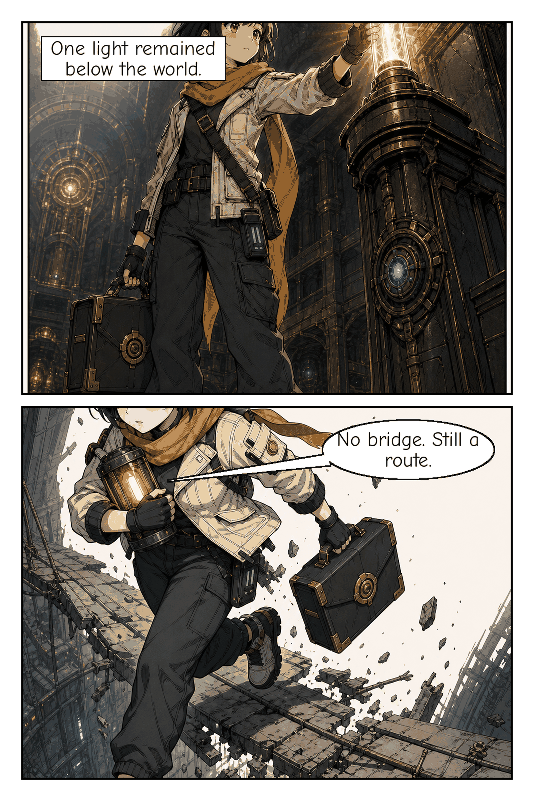
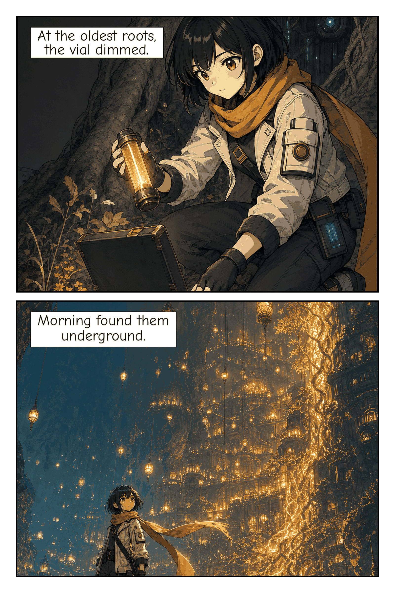

# Comic Sol

[](https://github.com/wenn-id/comicsol/actions/workflows/tests.yml)
[](https://github.com/wenn-id/comicsol/releases)
[](LICENSE)
[](https://www.python.org/)
[](docs/surfaces.md)
[](docs/install.md)

**Plan anywhere. Render anywhere. Resume everywhere.**

Comic Sol turns a prompt or story into an editable comic project, then helps an AI agent plan panels,
collect generated artwork, run QA, add lettering, compose pages, and export a PDF.

It is **local-first** and **provider-neutral**. Comic Sol is not an image generator: it works around
a compatible image tool supplied by the active agent, an external adapter/API, local ComfyUI, or
another agent through portable handoff. It stores no provider credentials and requires no build service.

This repository, [`wenn-id/comicsol`](https://github.com/wenn-id/comicsol), is the canonical, independent home of Comic Sol.

## What Comic Sol does

```text
prompt or story
    → editable plan and storyboard
    → image generation outside the deterministic engine
    → raster validation and visual QA
    → lettering and page composition
    → page PNGs + PDF + QA report
```

- Keeps plans, prompts, references, panels, pages, and QA artifacts editable.
- Resumes safely after interruption instead of losing the project.
- Moves work between Codex, Claude, Antigravity, ZCode, or another machine through a portable
  `.comic-sol-handoff` archive.
- Uses deterministic Python for project state, validation, lettering, composition, and export.

All named host integrations remain **Experimental** until their live evidence satisfies the [support matrix](docs/support-matrix.md); the portable project contract is the stable boundary.

Agent Skills, CLI, MCP, the Codex Plugin, and Comic Sol Studio are adapters around that same deterministic project engine.

Studio's full local `prompt → plan → review → image → QA → PDF` path is
offline-qualified with deterministic fake providers and restart coverage. This
does not mean any paid provider route is live-verified; see the
[Studio provider matrix](docs/web/providers.md) and
[live-evidence framework](docs/web/live-evidence.md).

## See the output

### Sunlight Courier

This is the repository's **only visual-quality sample** with retained live-generated evidence.





- [Open the PDF](samples/sunlight-courier/exports/sunlight-courier.pdf)
- [Page 1 PNG](samples/sunlight-courier/pages/page-001.png)
- [Page 2 PNG](samples/sunlight-courier/pages/page-002.png)
- [Editable project](samples/sunlight-courier/project.json)
- [QA report](samples/sunlight-courier/qa/report.md)
- [Provenance and limitations](samples/sunlight-courier/README.md)

One retained sample does not prove broad illustration quality. Deterministic fixtures are mechanics-only
evidence. See the [showcase contract](docs/showcase.md), [host smoke contract](docs/agent-host-smoke.md),
and [sample catalog](samples/README.md). Additional genuine Comic Sol results can be added here when
their publication rights, provenance, and QA evidence are retained.
Mechanics-only examples: [First Light Signal](samples/first-light-signal) and
[The Quiet Ledger](samples/the-quiet-ledger).

### Live agent-host lanes (Codex · Antigravity · ComfyUI)

Comic Sol is provider- and host-neutral: the same locked story spec can be driven from
different AI agent hosts, each supplying its own image route. Per the
[host smoke contract](docs/agent-host-smoke.md), no named agent host is yet **Verified**;
Codex and Antigravity retain local live records linked below (both **Experimental**,
output kept on the tester's lane and referenced by digest, not published here). Local
ComfyUI is an image provider, not an agent host, and is an experimental reference
executor (see [Image-generator support](docs/support-matrix.md#image-generator-support)).

| Agent host | Image route | Live record | Status |
|---|---|---|---|
| Codex | Agent-native image tool | [codex-2026-08-30](docs/agent-host-smoke/codex-2026-08-30.md) | Experimental |
| Google Antigravity | Agent-native image tool | [google-antigravity-2026-08-30](docs/agent-host-smoke/google-antigravity-2026-08-30.md) | Experimental |
| Local ComfyUI | Declared external adapter (SD 1.5) | reference executor, local smoke only | Experimental (image route) |

Generated page rasters and PDFs are kept off this repository by design — do not commit build output.

## Quick start

### 1. Install the Agent Skill

`skill-install` requires Comic Sol `v2.0.0rc6` or later. Because `v2.0.0rc6` is not yet published,
run this command only after installing an rc6-or-later package or native distribution whose release assets
are available, or from a trusted rc6 source checkout installed as a package.
The latest published prerelease is `v2.0.0rc4` and does not include `skill-install`.

```bash
comic-sol skill-install --target codex --scope user
```

Targets include `codex`, `claude`, `antigravity`, and `zcode`; supported user
and project placements are listed in
[getting started](docs/user/getting-started.md#1-install-the-agent-skill).
For the core CLI, follow the [native installer](docs/install.md) or
[manual source/wheel instructions](docs/install-manual.md). Guided initialization
and ready-made storyboards are documented in
[starter templates](references/starter-templates.md).

### 2. Check readiness

```bash
comic-sol doctor --output-root "$HOME/Comic Sol"
```

Source-checkout equivalent:

```bash
"$PYTHON" scripts/comic_sol.py doctor --output-root "$HOME/Comic Sol"
```

### 3. Ask for a comic

Open a fresh session where the Skill is installed:

> Make a 2-page manga about a courier delivering sunlight to an underground city.

One natural-language request is enough. The agent asks only for materially missing
choices and preserves a resumable `BLOCKED` project when no compatible image route
is available.

## Choose an image route

| Route | Use it when | Boundary |
|---|---|---|
| Agent-native image tool | The current AI host can generate and return a local raster | Preferred when its declared capabilities match |
| External adapter/API | The agent has an explicitly configured compatible tool | Credentials stay outside the deterministic engine |
| Portable handoff | Planning and rendering happen in different agents or devices | Export, import, inspect, then accept the returned raster |
| Local ComfyUI | You run ComfyUI on your own device | Experimental reference executor; hardware, power, storage, and model licenses remain yours |

For handoff, the short lifecycle is:

```bash
comic-sol handoff prepare "$PROJECT"
comic-sol handoff export "$PROJECT" --output "$PROJECT.comic-sol-handoff"
comic-sol handoff import "$PROJECT.comic-sol-handoff" --output-root "$OUTPUT_ROOT"
comic-sol handoff inspect "$IMPORTED_PROJECT"
comic-sol handoff accept-result "$IMPORTED_PROJECT" --job JOB_ID \
  --attempt N --executor-kind EXECUTOR_KIND --executor-id EXECUTOR_ID --path RASTER_PATH
```

Send the exact `jobs[].path` of a `ready` job to the executor, then pass its returned local image
as `--path RASTER_PATH`. The [complete handoff lifecycle](references/workflow.md#cross-agent-handoff-lifecycle)
covers required result arguments, archive export/import, failure categories,
reference approval, retries, resume, visual QA, and promotion.

## What you get

```text
project.json                       project state
plan/                              story, characters, and storyboard
prompts/                           editable image prompts
references/                        character and scene references
panels/                            generated, accepted, and lettered panels
pages/page-001.png                 composed pages
exports/<project-id>.pdf           final image-based PDF
qa/report.md                       checks and warnings
logs/                              sanitized lifecycle records
```

More detailed artifacts—including the character identity pack, SFX audit,
page-QA schema 2.1 records, `pdf_verification` descriptor, reference selection,
and repair plan—are documented in the
[schema reference](references/schemas.md#artifacts). Treat QA as evidence
with limits: offline tests prove deterministic mechanics, not live illustration
quality.

## Important limits

- Image quality and character continuity depend on the selected image capability.
- Exported PDFs are image-based, untagged, not PDF/UA, have no alt text, and have
  no extractable text layer; screen readers cannot read the dialogue.
- The interface and reports are English-only. Typography support and shaping limits
  are documented in [typography](docs/typography.md).
- Prompts and references sent to an image provider follow that provider's policies.
  Never put credentials or private secrets in story text or prompts.
- Large projects beyond four pages or twelve panels require an explicit scope decision.

Read [privacy](PRIVACY.md), [terms](TERMS.md), [support](SUPPORT.md), and
[security reporting](SECURITY.md) before handling sensitive projects.

## Advanced integrations

- **Run anywhere:** [surfaces](docs/surfaces.md) · [support matrix](docs/support-matrix.md) · [Studio](docs/web/index.md)
- **Install:** [native](docs/install.md) · [CLI, wheel, source, OCI, and native archive](docs/install-manual.md)
- **Trust:** [MCP trust boundary](docs/surfaces.md#mcp-server) · [security](SECURITY.md) · [release chain](docs/releases/release-trust-chain.md) · [rollback](docs/releases/rollback-runbook.md)

The local MCP adapter uses trusted `stdio`, stays inside one explicit output root,
and exposes exactly 17 `comic_*` tools. The
[Codex Plugin](docs/surfaces.md#codex-plugin-bundle) is available from
this same repository.

[Superpowers](https://github.com/obra/superpowers) is an optional, separately
installed companion for structured development; it is not required for Comic Sol
to run.

## Documentation

- **Create:** [getting started](docs/user/getting-started.md) · [resume, repair, export](docs/user/resume-repair-export.md) · [troubleshooting](docs/user/troubleshooting.md) · [opt-in creator evidence](docs/dogfood.md)
- **Install:** [native installer](docs/install.md) · [manual install](docs/install-manual.md) · [surface guide](docs/surfaces.md)
- **Understand:** [workflow](references/workflow.md) · [schemas](references/schemas.md) · [structured errors](docs/structured-errors.md)
- **Develop:** [contributing](CONTRIBUTING.md) · [agent rules](AGENTS.md) · [release criteria](docs/releases/v2.0-stable-criteria.md)

Milestones v2.0, v2.1, and v2.2 are complete but unreleased; see the
[delivery record](docs/releases/milestone-delivery.md). Published native artifacts
use `SHA256SUMS` and Sigstore verification. Development and test commands—including
the offline Python 3.11+ and Pillow 12.3.0 suite—live in
[CONTRIBUTING.md](CONTRIBUTING.md).

## License

Code and documentation are [MIT licensed](LICENSE). Bundled fonts retain their
separate SIL Open Font License 1.1 terms in [`assets/README.md`](assets/README.md).
